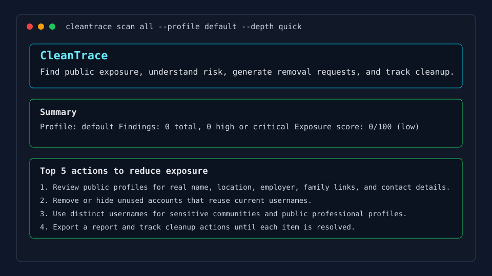

# CleanTrace

CleanTrace helps you find public exposure, understand risk, generate removal requests, and track cleanup.

It is an open-source, local-first CLI privacy exposure and OSINT self-assessment tool. The first milestone focuses on explicit consent profiles, encrypted local storage, username discovery across a small public site database, stored findings, and Markdown/HTML reports.

## What CleanTrace Does

- Creates local consent profiles for your own identifiers.
- Stores raw profile identifiers encrypted on your machine.
- Checks public username profile URLs using local YAML site definitions.
- Records findings with source, confidence, timestamp, severity, evidence, and remediation advice.
- Produces terminal summaries and Markdown/HTML reports.
- Ends scans with the top five actions to reduce exposure.

## What It Does Not Do

- It does not claim to delete you from the internet.
- It does not search arbitrary targets without a consent profile.
- It does not scrape leaked databases or store raw breach records.
- It does not store passwords or attempt logins.
- It does not steal browser cookies, bypass CAPTCHAs, or spam password reset endpoints.
- It does not upload findings, profile data, API keys, or tokens to a cloud backend.

## Install

```bash
python -m pip install -e ".[dev]"
```

CleanTrace requires Python 3.12 or newer.

## Quick Start

```bash
cleantrace init
cleantrace profile create --wizard
cleantrace scan all --profile default --depth quick
cleantrace findings --profile default
cleantrace report --profile default --format markdown --output cleantrace-report.md
cleantrace report --profile default --format html --output cleantrace-report.html
```

Non-interactive example:

```bash
cleantrace init --yes
cleantrace profile create --slug default --username yourhandle --email you@example.com --consent
cleantrace scan username yourhandle --profile default --depth quick
```

## Example Output

Example terminal captures are stored under `docs/screenshots/`.



## Privacy Model

CleanTrace is local-first:

- Config: `~/.config/cleantrace/config.toml`
- Data: `~/.local/share/cleantrace/`
- Database: `~/.local/share/cleantrace/cleantrace.db`
- Encryption key: `~/.local/share/cleantrace/cleantrace.key`
- User site definitions: `~/.config/cleantrace/sites.d/`

Raw profile identifiers are encrypted with Fernet. Findings store searchable hashes for scanned identifiers and avoid storing raw passwords or leaked records. Terminal output redacts sensitive values by default; use `--show-sensitive` only for local review.

## Threat Model

CleanTrace is designed to reduce accidental public exposure for a consenting user. It is not designed to protect against a compromised local machine, malicious plugins, or a hostile operator. Treat the local database and encryption key as sensitive files. Do not install untrusted plugins.

## Plugin System

Built-in scanner modules live under `src/cleantrace/plugins/`. A plugin declares:

- name and description
- supported input types
- risk label
- API key requirement
- scraping flag
- default enabled state
- rate limit guidance
- async `run()` method
- confidence and remediation output

Username discovery uses local YAML site definitions with this shape:

```yaml
name:
url:
check_url:
username_claimed_regex:
username_unclaimed_regex:
expected_status:
tags:
country:
enabled_by_default:
confidence_rules:
notes:
```

## API Keys

Milestone 1 does not require API keys. Milestone 2 will add optional HIBP support using the official API when a key is configured in `~/.config/cleantrace/config.toml`.

## Reports

Reports currently support:

- terminal summary
- Markdown
- HTML

Planned formats include JSON export expansion, CSV, and optional PDF.

## Roadmap

Milestone 1:

- `init`
- `profile create/list/show`
- username scan for initial public sites
- `findings`
- Markdown/HTML report
- local SQLite database
- Rich terminal UI

Milestone 2:

- HIBP integration
- GitHub connector
- removal templates and tracker
- safer phone/domain/name modules via configured APIs

Milestone 3:

- Textual TUI
- Google Takeout import
- broader plugin marketplace
- local Ollama summariser

## Legal and Ethical Disclaimer

Use CleanTrace only for your own identifiers or for people who have given clear permission. Respect site terms, rate limits, robots.txt where applicable, and local law. CleanTrace findings are leads for manual review, not proof of identity.
